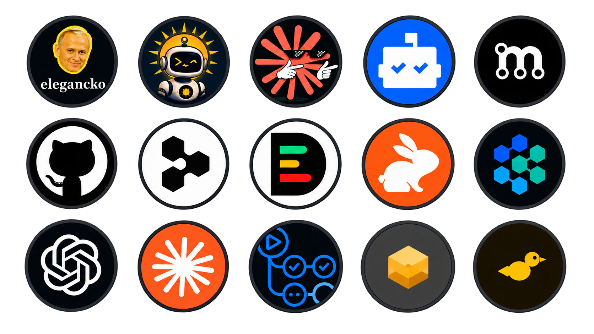

**Prywatny hol dowodzenia: projekty, usługi, narzędzia i szuflady w jednym miejscu.**

  

 

**Polski** · [English](README.md) · [简体中文](README_zh.md)

 

  
    
  

---

## 🔀 Otwarte pull requesty

<!--OPEN_PRS:START-->
| Repozytorium | PR | Tytuł | Autor | Stan | Aktualizacja |
| --- | ---: | --- | --- | --- | --- |
| trvny/feedseek | [#367](https://github.com/trvny/feedseek/pull/367) | fix(sources): refresh stale upstreams | @trvny | gotowy | 2026-09-05 |
| trvny/feedseek | [#368](https://github.com/trvny/feedseek/pull/368) | chore: disable 1337x feed | @trvny | gotowy | 2026-09-05 |
| trvny/trvny | [#480](https://github.com/trvny/trvny/pull/480) | docs: align repository docs with current tree | @trvny | gotowy | 2026-09-05 |
<!--OPEN_PRS:END-->

## 🧭 Mapa projektów

### Główne repozytoria

| projekt | wejścia | co tam siedzi |
|---|---|---|
| 📡 **Feedseek** | [repo](https://github.com/trvny/feedseek) · [strona](https://trvny.github.io/feedseek) · [czytnik](https://trvny.github.io/feedseek/reader/) | Generator i publikator RSS/Atom dla źródeł bez użytecznych natywnych feedów. |
| 🐤 **Kanarek** | [repo](https://github.com/twojstar/kanarek) | Androidowy czytnik RSS/Atom, widżety oraz odtwarzacz radia/IPTV. |
| 📺 **TVPI** | [repo](https://github.com/trvny/tvpi) · [strona](https://trfny.com/tv/) · [playlista](https://tvpi.travny.workers.dev/playlist.m3u) | Stabilne wejścia IPTV do kanałów TVP, Worker oraz residential-push do odświeżania tokenów HLS. |
| 🚗 **Autka** | [repo](https://github.com/twojstar/Autka) | Androidowy agregator ofert samochodów z Polski, UE i importu z USA, razem z kalkulacją kosztu sprowadzenia. |
| 🤖 **LlmBench** | [repo](https://github.com/twojstar/llmbench) | Androidowy hub do czatów AI przez konta oraz darmowych providerów LLM. |
| 🔊 **WAM Bridge** | [repo](https://github.com/twojstar/wambridge) | Most audio do głośników Samsung Wireless Audio Multiroom oraz natywne wyjście foobar2000 dla Shape M5. |

### Narzędzia przeniesione do twojstar/twojstar

| projekt | wejście | przeznaczenie |
|---|---|---|
| 🔳 **[Codebench](https://github.com/twojstar/twojstar/tree/main/benches/codebench)** | [codebench.trfny.com](https://codebench.trfny.com) | Prywatne, przeglądarkowe studio QR i kodów kreskowych. Dane nie opuszczają przeglądarki. |
| 📻 **[Streambench](https://github.com/twojstar/twojstar/tree/main/benches/streambench)** | [streambench.trfny.com](https://streambench.trfny.com) | Warsztat do testowania, porządkowania i odtwarzania IPTV, radia, HLS, M3U oraz XMLTV. |
| 📄 **[Docbench](https://github.com/twojstar/twojstar/tree/main/benches/docbench)** | [docbench.travny.workers.dev](https://docbench.travny.workers.dev) | Lokalne studio dokumentów i PDF do edycji, podglądu, walidacji, łączenia, operacji na stronach i zakładkach. |
| 🌦️ **[weather-feed](https://github.com/twojstar/twojstar/tree/main/weather-feed)** | [weather.trfny.com](https://weather.trfny.com) | Wieloźródłowa pogoda i alerty IMGW dla Kościelca/Chrzanowa, wystawione jako Atom i JSON. |
| 🩺 **[status-mcp](mcp/status-mcp/)** | MCP | Jedno narzędzie do zbiorczego sprawdzania zdrowia TVPI, Feedseek, Weather i Autek. |
| 🤖 **[AI core](https://github.com/trvny/.ai)** | [.ai/](.ai/) | Publiczny rdzeń konfiguracji AI + prywatny profil, archiwum i projektowe skillsy. |

## 🗄️ Szuflady

[`playlists`](stuff/playlists/) · [`configs`](stuff/configs/) ·
[`feeds`](stuff/feeds/) · [`quotes`](stuff/quotes/) · [`other`](stuff/other/)

- **Playlisty**: robocze i testowe M3U/M3U8 dla Streambencha oraz odtwarzaczy.
- **Konfiguracje**: rzeczy współdzielone, których nie warto zamykać w osobnym repo.
- **Feedy i cytaty**: źródła pomocnicze używane przez automaty i widżety.

## 🧪 Pozostałe repozytoria

| repo | rola |
|---|---|
| [WiFi-Automatic](https://github.com/trvny/WiFi-Automatic) | fork aplikacji automatyzującej radio Wi-Fi na Androidzie |

## Ja i moje ziomki

  

## [Licencja](LICENSE) 

[ISC](https://spdx.org/licenses/ISC). [THIRD_PARTY_NOTICES](docs/THIRD_PARTY_NOTICES.md).

---
## 💬 Cytat z szuflady

<!-- markdownlint-disable MD033 -->
<!--STARTS_HERE_QUOTE_README-->
<i>❝IMDb is one of the oldest websites on the internet, and began on Usenet in 1990 as a list of “actresses with beautiful eyes.”❞</i>
<!--ENDS_HERE_QUOTE_README-->
<!-- markdownlint-enable MD033 -->

## 📰 Ostatnio w eterze

<!--README_FEED:START-->
- [How to Engage with New Media: A Strategic Guide for Nonprofit Organizations](https://carnegieendowment.org/research/2026/08/how-to-engage-with-new-media-a-strategic-guide-for-nonprofit-organizations)
- [How the U.S. Export-Import Bank Can Finally Join the Fight Against Climate Change](https://carnegieendowment.org/research/2026/09/renewable-energy-investment-united-states-exim-export-import-bank)
- [Darmowa telewizja na YouTube: ponad 210 oficjalnych kanałów na żywo z Polski i świata, sprawdzanych codziennie](https://promptowy.com/darmowa-telewizja-na-youtube-lista-kanalow-na-zywo/)
- [Przegląd AI: 5 września 2026](https://promptowy.com/przeglad-ai-2026-09-05/)
- [Zamknięcie dnia: Kto traci, gdy AI robi wszystko za nas](https://promptowy.com/zamkniecie-dnia-kto-traci-gdy-ai-robi-wszystko-za-nas/)
- [Putin says US-Russia contacts beneficial as talks begin with Witkoff and Kushner](https://www.reuters.com/world/europe/putin-says-us-russia-contacts-beneficial-talks-begin-with-witkoff-kushner-2026-09-05/)
<!--README_FEED:END-->

consolidation over fragmentation · po kolei, na spokojnie

