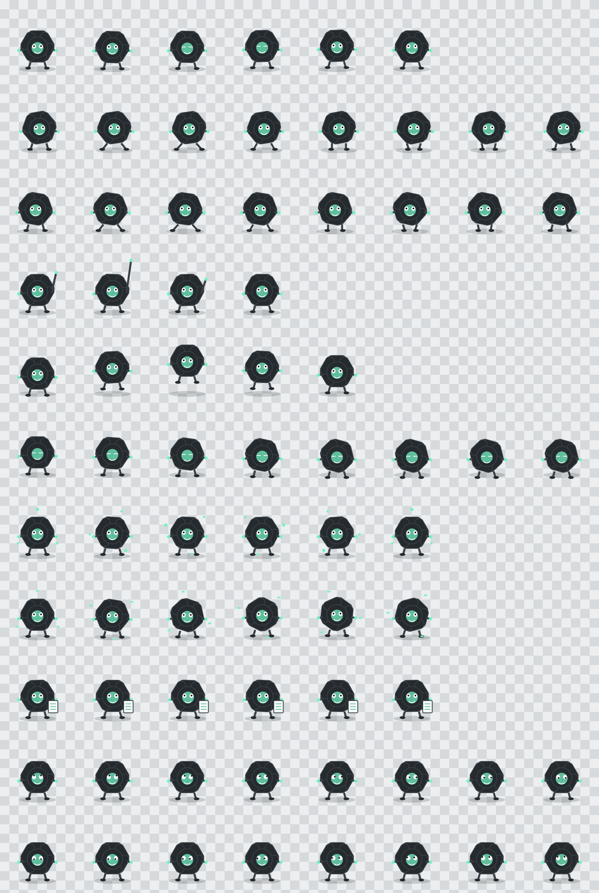

# Loopling 🌀

**A tiny living loop-knot companion made for ChatGPT and Codex.**

Loopling is an original animated desktop pet built for ChatGPT's native Pets system. It is deliberately *inspired by the idea* of ChatGPT's looping mark without reproducing the OpenAI logo: six soft graphite loops, a mint core, big tracking eyes, tiny feet, and just enough personality to judge your diffs.



## Personality

- calm breathing and blinking while idle
- directional walking with alternating steps
- enthusiastic one-arm wave
- squash-and-hop jump
- full-body existential collapse on failure
- orbiting mint dots while waiting for you
- spinning loops and sparks while working
- tiny document inspection during review
- 16-direction gaze tracking

Loopling is unofficial fan-made artwork and is not affiliated with or endorsed by OpenAI.

## Install

### Windows

```powershell
.\scripts\install.ps1
```

### macOS / Linux

```bash
./scripts/install.sh
```

Or copy `pet/pet.json` and `pet/spritesheet.webp` into `~/.codex/pets/loopling/` manually. If `CODEX_HOME` is set, use `$CODEX_HOME/pets/loopling/` instead.

Then fully restart ChatGPT, open **Settings → Pets**, refresh if needed, and choose **Loopling**.

## ChatGPT Pet v2 contract

The runtime atlas is a lossless transparent WebP: `1536×2288`, 8×11 cells, `192×208` each. It contains all 57 standard animation frames plus 16 clockwise gaze directions and declares `"spriteVersionNumber": 2`.

`gallery/validation.json` records deterministic format checks. `gallery/previews/` contains GIF previews for all nine standard states.

## Repository

```text
pet/                   installable ChatGPT/Codex pet
  pet.json
  spritesheet.webp
gallery/               contact sheet, previews and validation
scripts/               tiny installers
tools/generate.py      deterministic source-art generator
```

Regenerate everything with:

```bash
python tools/generate.py
```

The art is procedural, so there is no mystery source PSD hiding in somebody's Downloads folder.

## License

MIT. See [LICENSE](LICENSE).
